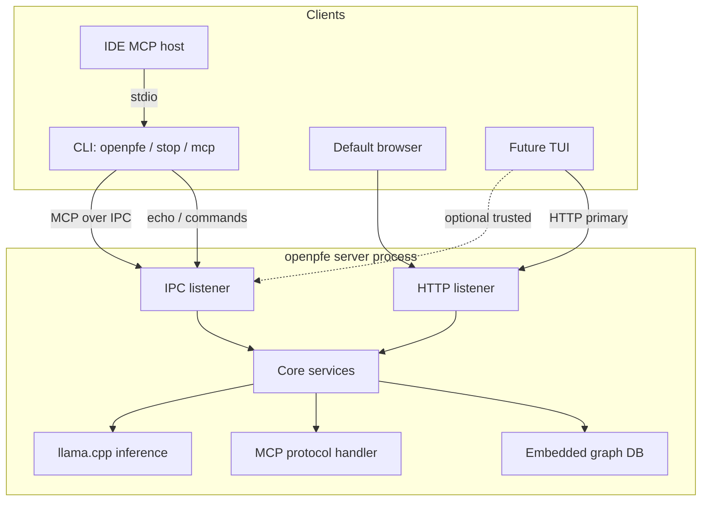

# openpfe — Architecture

System overview. **Normative detail** is in [crates/](./crates/); **multi-crate contracts** in [cross-cutting.md](./cross-cutting.md).

## Decisions (index)

| Topic | Decision | Detail |
|-------|----------|--------|
| **Server scope** | One server per project (`./.openpfe/`) | [cross-cutting.md](./cross-cutting.md) |
| **Project data** | `server.json`, `llm.json`, graph under `./.openpfe/` (JSON; **cwd** = project root) | [openpfe-server/design.md](./crates/openpfe-server/design.md), [openpfe-llm/design.md](./crates/openpfe-llm/design.md), [openpfe-graph/design.md](./crates/openpfe-graph/design.md) |
| **Shared (machine)** | Model weights under `USER_HOME/.openpfe/models/` | [openpfe-llm/specification.md](./crates/openpfe-llm/specification.md) |
| **IPC (v1)** | Unix domain sockets (macOS/Linux) | [openpfe-ipc/design.md](./crates/openpfe-ipc/design.md) |
| **Graph store** | **IndraDB + RocksDB**, `./.openpfe/graph/store/` | [openpfe-graph/specification.md](./crates/openpfe-graph/specification.md) |
| **Project root** | **cwd** = project root | [cross-cutting.md](./cross-cutting.md) |
| **HTTP address** | From IPC echo only | [openpfe-ipc/specification.md](./crates/openpfe-ipc/specification.md) |
| **Singleton** | `flock` on `./.openpfe/server/pid` | [openpfe-server/design.md](./crates/openpfe-server/design.md) |
| **Human vs agent** | `openpfe-ui` (HTTP) / `openpfe-mcp` (IPC) | [workspace-crates.md](./workspace-crates.md) |
| **Local LLM** | `openpfe-llm` in v1 | [openpfe-llm/design.md](./crates/openpfe-llm/design.md) |
| **HTTP stack (v1)** | **axum** on **hyper** (router in `openpfe-ui`) | [openpfe-ui/design.md](./crates/openpfe-ui/design.md) |
| **HTTP middleware** | **tower-http** `TraceLayer` only in v1 (no `CorsLayer`) | [openpfe-server/design.md](./crates/openpfe-server/design.md), below |
| **Async runtime (v1)** | **tokio** workspace-wide | [openpfe-server/design.md](./crates/openpfe-server/design.md) |
| **Graph crate** | Separate **`openpfe-graph`** member; **IndraDB** (RocksDB) | [openpfe-graph/design.md](./crates/openpfe-graph/design.md) |
| **TUI transports** | Data over HTTP; control over IPC only | Below |

## Technology stack (v1)

| Layer | Choice | Rationale |
|-------|--------|-----------|
| **HTTP server** | [hyper](https://hyper.rs/) (via axum) | Underlying HTTP/1.1; not used directly in app code. |
| **Routing / handlers** | [axum](https://github.com/tokio-rs/axum) | `Router`, extractors, JSON bodies; `openpfe-ui` exports API routes, `openpfe-server` composes the app. |
| **Middleware** | [tower](https://github.com/tower-rs/tower) + [tower-http](https://github.com/tower-rs/tower-http) | axum is already tower-based; **tower-http** supplies cross-cutting HTTP layers on the composed router in `openpfe-server`. |
| **Async** | [tokio](https://tokio.rs/) workspace-wide | Concurrent IPC accept, HTTP, and multiple MCP bridges; `openpfe-llm` uses `spawn_blocking` for inference inside the server runtime. |
| **IPC transport** | tokio UDS (via `openpfe-ipc`) | Aligns with async server; see [openpfe-ipc/design.md](./crates/openpfe-ipc/design.md). |

**Not** a separate HTTP framework: tower-http **complements** axum; it does not replace it.

### tower-http (v1)

Applied in **`openpfe-server`** on the merged router (after nesting `openpfe-ui` + static fallback from `openpfe-webui`). Primary planned layers:

| Layer | Intent |
|-------|--------|
| **`TraceLayer`** | Request/response logging (access-style traces). |
| **`CorsLayer`** | **Not used in v1** — same-origin Web UI; add when a cross-origin dev client is required ([openpfe-server/design.md](./crates/openpfe-server/design.md)). |

Other tower-http utilities:

| Layer / utility | Use in openpfe v1 |
|-----------------|-------------------|
| `SetResponseHeaderLayer` | Optional security/cache headers on static responses (if not set in embed handler). |
| `CompressionLayer` | **Defer** — localhost-first; static embed may already compress (e.g. static-serve). |
| `ServeDir` / `ServeFile` | **Not used** — filesystem only; embedded UI uses a separate embed crate. |
| `ServeEmbed` | **Not in tower-http** — see [**tower-embed**](https://docs.rs/tower-embed); one embed option for `openpfe-webui`. |

Embedded static UI: **`openpfe-webui`** exports axum router via **`rust-embed`** — [openpfe-webui/design.md](./crates/openpfe-webui/design.md#embedded-static-serving-v1). `openpfe-server` nests it under `/` after `/api/v1`.

Body size limits and route-specific limits: axum built-ins (e.g. `DefaultBodyLimit`) in `openpfe-ui` where uploads matter.

**`openpfe-graph`** exposes **sync** graph APIs where practical; async boundaries live at server, IPC, and HTTP layers.

## Purpose

Long-running local **openpfe** service per project: problem graph, web UI, MCP for IDE agents, local LLM. Clients: CLI, browser, MCP stdio, future TUI.

## High-level structure

## Client transports

See [workspace-crates.md](./workspace-crates.md#client-transports-decided) (authoritative matrix).

### TUI (v1)

Future TUI follows the same split as Web UI + CLI control:

| Concern | Transport | API |
|---------|-----------|-----|
| Graph, config, models, inference | **HTTP only** | `/api/v1/…` via `openpfe-ui` (same as browser) |
| Server up / `http_base_url` | **IPC** | `type: echo` — [openpfe-ipc/specification.md](./crates/openpfe-ipc/specification.md) |
| Graceful stop | **IPC** | `type: shutdown` (same as `openpfe stop`) |
| MCP / agent tools | **Not via TUI** | IDE uses `openpfe mcp` stdio bridge |

No graph or config **over IPC** for TUI in v1 (avoids duplicating the human API). Optional future: `type: status` admin envelope for TUI/CLI diagnostics — not required for first TUI.

## Startup scenarios

| Invocation | If server down | If server up |
|------------|----------------|--------------|
| `openpfe` | Spawn detached server → echo OK → open browser → exit | Echo OK → browser → exit |
| `openpfe mcp` | Spawn if needed → stdio MCP bridge over IPC | Bridge to existing server |
| `openpfe stop` | Exit 0, `server not running` on stderr | IPC shutdown |

Flow detail: [cross-cutting.md](./cross-cutting.md#multi-crate-flows), [openpfe/design.md](./crates/openpfe/design.md).

## Rust workspace

**8 members** in v1. Members, deps, phasing: **[workspace-crates.md](./workspace-crates.md)**.

## External alignment

Functional scope: crate [requirements.md](./crates/openpfe/requirements.md) files — [FR traceability](./cross-cutting.md#fr-traceability).

## Related documents

| Document | Contents |
|----------|----------|
| [README.md](./README.md) | Doc layout |
| [cross-cutting.md](./cross-cutting.md) | Multi-crate contracts, FR traceability |
| [workspace-crates.md](./workspace-crates.md) | Members, deps, [documentation convention](./workspace-crates.md#documentation-convention) |
| [crates/](./crates/) | Per-crate `design` / `requirements` / `specification` |
| [openpfe-graph/graph-db-evaluation.md](./crates/openpfe-graph/graph-db-evaluation.md) | Graph engine research |
