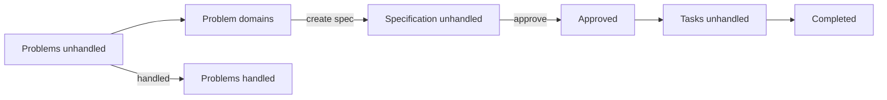

# openpfe-webui — product UI documentation

High-level design, requirements, and behaviour for the embedded browser **working canvas**. No HTTP paths, JSON schemas, or JavaScript layout — those belong in **`openpfe-ui`** and [../design.md](../design.md) (toolchain).

**Purpose:** Input for front-end implementation and **`openpfe-ui`** API design.

---

## Views

| View | Primary question | Docs |
|------|------------------|------|
| [Dashboard](./dashboard/) | What needs attention? | [design](./dashboard/design.md) · [requirements](./dashboard/requirements.md) · [specification](./dashboard/specification.md) |
| [Problem](./problem/) | What problems exist and how do we refine them? | [design](./problem/design.md) · [requirements](./problem/requirements.md) · [specification](./problem/specification.md) |
| [Architecture](./architecture/) | How are problems grouped and how do domains interact? | [design](./architecture/design.md) · [requirements](./architecture/requirements.md) · [specification](./architecture/specification.md) |
| [Specification](./specification/) | What must be built and is it agreed? | [design](./specification/design.md) · [requirements](./specification/requirements.md) · [specification](./specification/specification.md) |
| [Task](./task/) | What implementation work is outstanding? | [design](./task/design.md) · [requirements](./task/requirements.md) · [specification](./task/specification.md) |
| [Debug](./debug/) | Are LLM and MCP integrations alive? | [design](./debug/design.md) · [requirements](./debug/requirements.md) · [specification](./debug/specification.md) |
| [Configuration](./configuration/) | Which LLM model is active and installed? | [design](./configuration/design.md) · [requirements](./configuration/requirements.md) · [specification](./configuration/specification.md) |

---

## Shared

| Topic | Location |
|-------|----------|
| Application shell (navigation) | [shell/](./shell/) |
| Domain concepts | [shared/concepts.md](./shared/concepts.md) |
| Lifecycle, collaboration, conceptual API needs | [shared/design.md](./shared/design.md) |
| Entity states, cross-view rules | [shared/specification.md](./shared/specification.md) |

---

## Lifecycle (summary)

Detail: [shared/design.md](./shared/design.md).

---

## Crate docs (not product UI)

| Doc | Scope |
|-----|--------|
| [../design.md](../design.md) | Vite, `build.rs`, `rust-embed` |
| [../requirements.md](../requirements.md) | FR-6 embed and build |
| [../specification.md](../specification.md) | Static routes, Cargo/npm |

---

## Related

- [openpfe-ui/design.md](../../openpfe-ui/design.md) — HTTP API (extend using view docs above)
- [webdesign.md](../../../guidelines/webdesign.md) — visual and interaction guidelines
