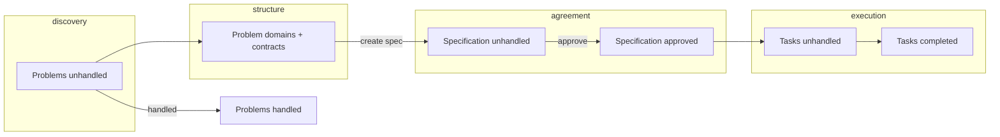

# Shared product design

**Scope:** Cross-view structure — role in the system, collaboration channels, lifecycle, conceptual API needs. Per-view detail lives in each view folder; shell in [../shell/](../shell/).

---

## Role in the system

The Web UI is where the **human engineer** and **local AI** collaborate on the problem graph, architecture, specifications, and tasks. Persistent truth lives behind **`/api/v1/…`** (`openpfe-ui`). The front-end orchestrates presentation, selection, and LLM/MCP affordances; it does not own domain rules.

```
┌──────────────────────────────────────────────────────────────────┐
│  Shell: nav + shared status (project, connection, errors)        │
├─────────┬─────────┬──────────────┬─────────┬──────┬────────┬──────┤
│Dashboard│ Problem │ Architecture │  Spec   │ Task │ Config │ Debug│
└─────────┴─────────┴──────────────┴─────────┴──────┴────────┴──────┘
```

Index: [../README.md](../README.md).

---

## Collaboration model

| Channel | Views | Intent |
|---------|-------|--------|
| **Embedded local LLM** | [Problem](../problem/), [Debug](../debug/) | In-canvas refinement: decompose, suggest sub-problems, draft text |
| **MCP handoff** | Problem, Debug | Actionable command for **external** agent (IDE); context shield via MCP |
| **Human review** | [Specification](../specification/) | Gate before tasks — specs not “done” until approved |

Embedded LLM vs MCP must be visually distinct.

---

## Lifecycle



| Transition | View |
|------------|------|
| Problem → handled | [Problem](../problem/) — does not require a domain |
| Domain → specification | [Architecture](../architecture/) initiates; [Specification](../specification/) completes |
| Specification → tasks | Automatic on approval (user-visible) |
| Task → completed | [Task](../task/) |

---

## Conceptual API needs (informative)

Capabilities **`openpfe-ui`** must eventually expose — not endpoint lists.

| Area | UI needs |
|------|----------|
| **Overview** | Counts and rollups → [Dashboard](../dashboard/) |
| **Problems** | Graph ops, handled flag, hierarchy → Problem |
| **Domains** | Membership, metadata → Architecture |
| **Dependencies & contracts** | Cross-domain edges and documents → Architecture |
| **Specifications** | Draft/review/approve; link to domain; task creation on approve → Specification |
| **Tasks** | List by status; links to spec/domain → Task |
| **LLM (inference)** | Prompt/complete for embedded panel and Debug |
| **LLM (setup)** | `llm.json`, catalog, download, active model → [Configuration](../configuration/) |
| **MCP** | Debug transport; handoff payload/command for Problem |

v1 server: REST + poll ([openpfe-ui/design.md](../../../openpfe-ui/design.md)).

---

## Out of scope

- Vite, `rust-embed`, MIME, module layout ([../../design.md](../../design.md)).
- Graph layout algorithms, contract file format, MCP tool names.
- Authentication (deferred).
