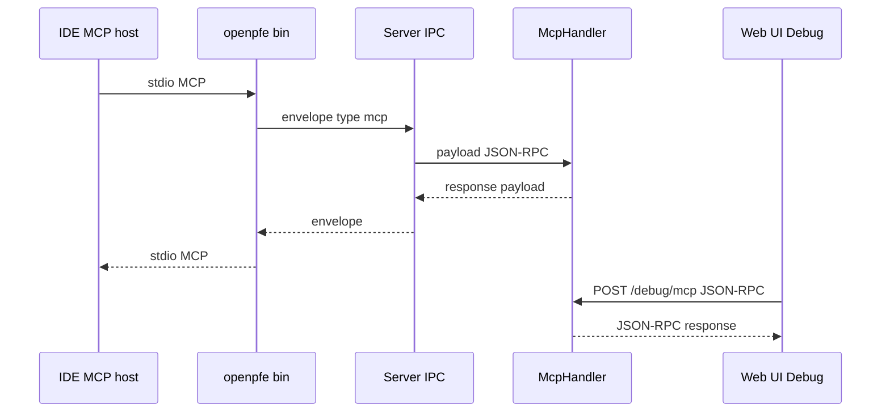

# MCP (Model Context Protocol)

**Read when:** implementing `openpfe-mcp`, the `openpfe mcp` stdio bridge, MCP tools/resources, or agent-facing graph access.

**Normative refs:** [openpfe-mcp/specification.md](../crates/openpfe-mcp/specification.md), [openpfe-ipc/specification.md](../crates/openpfe-ipc/specification.md), [openpfe_tooling.md](../../openpfe_tooling.md), [pfe_methodology.md](../../pfe_methodology.md).

## Architecture

- **Host attachment (agents):** `openpfe mcp` exposes MCP on **stdio** per [Model Context Protocol](https://modelcontextprotocol.io/).
- **Server handler:** `McpHandler` in `openpfe-mcp` — one instance per server process.
- **Transports:** IPC `type: mcp` (agents); HTTP `POST /api/v1/debug/mcp` in `openpfe-ui` (browser Debug). Tool semantics live only in `openpfe-mcp`.

## Implementation rules

1. **Delegate domain work** to `openpfe-graph` — MCP layer maps protocol ↔ domain only.
2. **Context shield:** tools return the **minimum** graph context for the requested component/task (per [openpfe_tooling.md](../../openpfe_tooling.md)); avoid dumping the full graph by default.
3. **Tool/resource names** are stable once published; breaking renames require version note in `openpfe-mcp/specification.md`.
4. **Errors:** map domain failures to MCP-compliant JSON-RPC errors; do not leak stack traces on stdio.
5. **No HTTP routes in MCP crate** — HTTP debug transport lives in `openpfe-ui`; `openpfe-mcp` exports `McpHandler` only per [workspace-crates.md](../workspace-crates.md).

## stdio bridge (`openpfe` binary)

- Spawn or attach to existing server (same singleton rules as CLI).
- One MCP session per process invocation unless spec defines multiplexing.
- Forward JSON-RPC (or batch) between stdio and IPC `payload` without altering semantics.
- Log diagnostics to stderr, not stdout — stdout is protocol stream.

## Tools and resources (v1)

Normative list: [openpfe-mcp/specification.md](../crates/openpfe-mcp/specification.md).

| Intent | v1 surface |
|--------|------------|
| Query subgraph for a component | Tool `openpfe_graph_subgraph` + resource `graph://cluster/{id}/subgraph` |
| Fetch node / contract | Tools `openpfe_graph_get_node`, `openpfe_contract_get` |
| Validate dependencies | Tool `openpfe_graph_validate` |
| LLM refinement / drill suggestions | **HTTP** + `openpfe-llm` — **not** MCP in v1 |

## Testing MCP

- Unit-test handler logic with mock core/graph.
- Integration: stdio client fixture driving `openpfe mcp` against a test server — see [testing-rust.md](./testing-rust.md).
- HTTP debug: `POST /debug/mcp` with JSON-RPC fixtures against mounted `api_router` — same handler as IPC.
- Do not require IDE for automated tests.

## Related

- [protocols.md](./protocols.md) — IPC envelope and `type: mcp`
- [coding-rust.md](./coding-rust.md) — crate boundaries
- [cross-cutting.md#fr-traceability](../cross-cutting.md#fr-traceability) — FR-9 ownership
